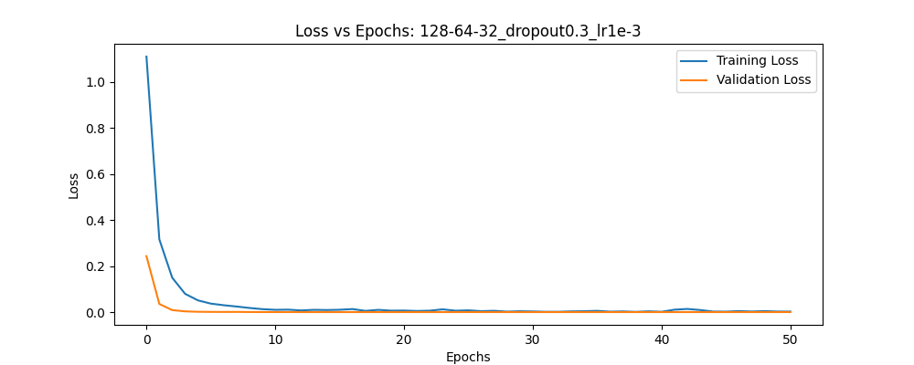
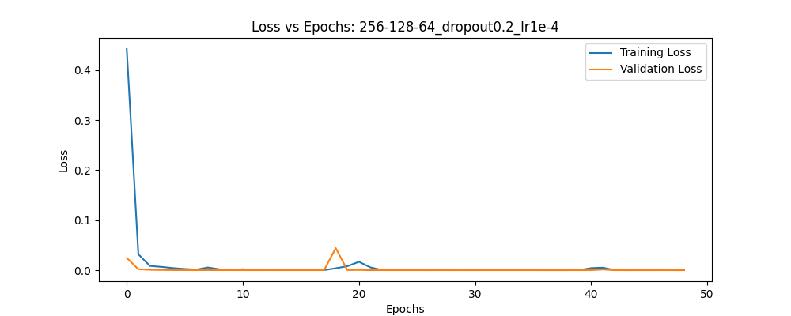
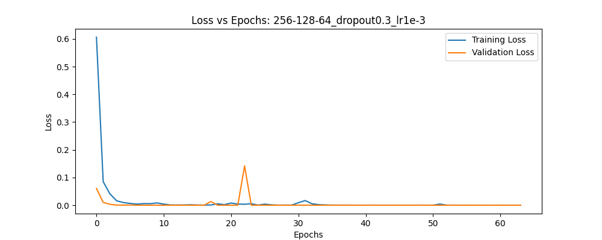
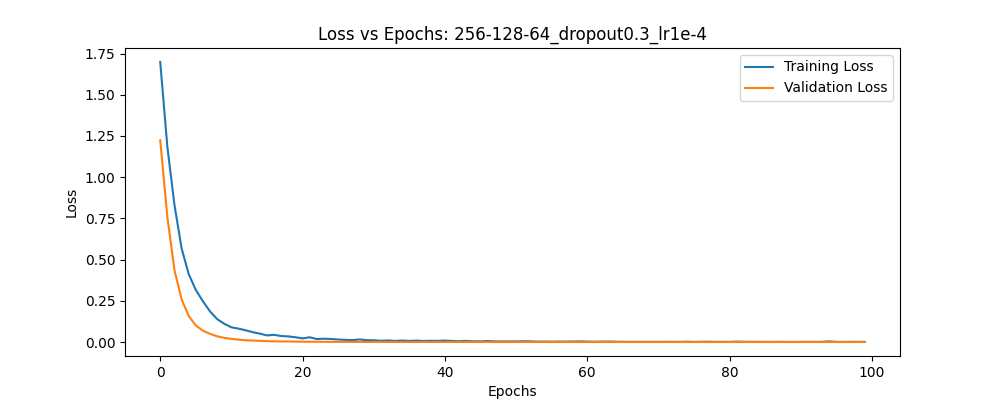

# Yogamer 🧘 Yoga Tracker

## What it Does

Yogamer is a real-time yoga pose classification system that uses a webcam to detect and identify yoga poses as you perform them. It combines MediaPipe's pose estimation model — which tracks 33 body landmarks in real time — with a custom-trained multilayer perceptron (MLP) neural network to classify poses such as Child's Pose, Cobra Pose, Butterfly Pose, Downward Dog, Seated Forward Fold, and Ground Quad Stretch. The system normalizes all landmark coordinates relative to the hip midpoint and torso size, making classification robust to different body sizes, camera distances, and positions. If the model's confidence falls below a threshold, the system displays a "Resting" state rather than forcing a classification. Once a pose is held consistently, the session logs an active timer of that pose. Once the user stops, the time doing the pose is added to the pose catalog from which the user can observe their progress. The session allows the capture of all registered poses, meaning that the user may switch between poses, and Yogamer would track all of it for the user.

---

### Motivation

During a time of heightened fitness culture, push-up counters and gym tracking apps are everywhere. However, one important aspect of physical health is often overlooked — flexibility. Flexibility has long been linked to outcomes like back pain relief, injury prevention, and better posture, yet it remains one of the least studied components of physical fitness, with no large-scale research programs specifically designed to understand its impact on health (Institute of Medicine, 2012). Yoga addresses this gap directly, improving joint mobility and range of motion so that joints and ligaments can keep pace with the muscles being built — letting you move the way you actually want to.

The science backs this up: flexibility training through practices like yoga and stretching can increase range of motion after just a single session, with even greater gains accumulating over weeks of regular practice. What's more, stretching one area of the body has been shown to improve flexibility in non-adjacent joints too, making yoga an efficient tool for whole-body mobility (Konrad et al., 2024). Built with extensibility in mind, new poses can be added simply by collecting additional training data and retraining the model. More functionalities that motivate yoga may be added later as well.

References:
- Institute of Medicine. (2012). Fitness measures and health outcomes in youth. National Academies Press. https://www.ncbi.nlm.nih.gov/books/NBK241323/
- Konrad et al. (2024). The effects of chronic stretch training on musculoskeletal pain. NCBI. https://www.ncbi.nlm.nih.gov/pmc/articles/PMC12354564/

---

## Quick Start

**Data Collection** (yogamer_cv environment):
```bash
conda activate yogamer_cv
python data_capture.py
```
- Change `LABEL` at the top of `data_capture.py` to the pose name
- Press `s` to record 5 seconds of pose data
- Press `q` to quit

**Train the Model** (yogamer_train environment):
```bash
conda activate yogamer_train
# Open and run all cells in train_model.ipynb
```

**Real-Time Classification** (yogamer_cv environment):
```bash
conda activate yogamer_cv
python backend_app.py
```
- Press `q` to quit

---

## Video Links

- 🎥 Demo Video: _coming soon_
- 🔧 Technical Walkthrough: _coming soon_

---

## Evaluation

### Choosing Optimizer

Looking at the nature of this problem, the best optimizers for this between SGD and Adam. 
I provide a sample of the training as reference.

The model parameters used were 3-layers, 256 → 128 → 64, dropout = 0.3. The learning rate was varied and the best result was chosen. 

- **SGD** - Momentum was set to 0.9 to allow it to converge faster
    
    Epoch 12/100
    73/73 ━━━━━━━━━━━━━━━━━━━━ 0s 4ms/step - accuracy: 0.9738 - loss: 0.1110 - val_accuracy: 0.9961 - val_loss: 0.0202
    
    Epoch 13/100
    ...
    
    Epoch 100/100
    73/73 ━━━━━━━━━━━━━━━━━━━━ 0s 4ms/step - accuracy: 0.9987 - loss: 0.0062 - val_accuracy: 1.0000 - val_loss: 6.7399e-05

- **Adam** - 
    
    Epoch 12/100
    73/73 ━━━━━━━━━━━━━━━━━━━━ 0s 4ms/step - accuracy: 1.0000 - loss: 9.1441e-04 - val_accuracy: 1.0000 - val_loss: 7.2806e-05
    
    Epoch 13/100
    ...
    
    Epoch 64/100
    73/73 ━━━━━━━━━━━━━━━━━━━━ 0s 4ms/step - accuracy: 1.0000 - loss: 5.0897e-05 - val_accuracy: 1.0000 - val_loss: 4.1424e-09

In use in yogamer_app.py, SGD was better for admitting low confidence in noise, meaning that resting state was accurately identified. However, some of the poses were inaccurately identified (Butterfly became seated forward fold). The larger issue is that when I held a pose, it seemed to constantly shifting between it and another state, breaking the time. Changing the threshold made it where the resting state started becoming classified as a pose. While Adam had some issue in classifying resting state as a pose, it was near completely accurate in classifying poses. As such Adam was choosen.  

### Hyperparameter Tuning

There are many hyperparameters that could be adjusted, so I only tuned the ones I felt were most significant.

- **Epochs, batch size, & patience** — batch size of 32 was used. It is standard and outperformed other options in testing through class. Epochs and patience work in tandem — patience ensures the model stops early before overfitting, so most training runs do not reach the full 100 epochs.
- **Train/validation/test split** — I utilized the standard from class: 70/30 train/test split with 10% of training held out for validation, producing a 63/7/30 train/validation/test split.
- **Architecture depth** — I utilize the standard 3-layer depth since the number of inputs does not increase (132).

The following table documents the results of tuning the remaining hyperparameters — learning rate, architecture width, and dropout rate:

| Config | Architecture | Learning Rate | Dropout | Val Accuracy | Test Accuracy | Applied Performance |
|---|---|---|---|---|---|---|
| Baseline | 128 → 64 → 32 | 0.001 | 0.3 | 1.000 | 1.000 | Poor |
| Wider | 256 → 128 → 64 | 0.001 | 0.3 | 1.000 | 1.000 | Decent |
| Lower LR | 256 → 128 → 64 | 0.0001 | 0.3 | 1.000 | 1.000 | Poor |
| Lower DR | 256 → 128 → 64 | 0.001 | 0.2 | 1.000 | 1.000 | Poor |

Notes about Applied Performance in `yogamer_app.py`:
- **Baseline** — Quick to classify random states as poses with 1.00 confidence (viewing of my face was classified as Butterfly Pose).
- **Wider** — Fixes issues of Baseline, but classifies transitioning into a pose as the pose itself. Not much of an issue currently due to the 4s timer, but would be problematic in the future when poses are similar.
- **Lower LR** — Reverts back to Baseline behavior. This is likely due to overfitting of the training data.
- **Lower DR** — Reverts back to Baseline. The lower dropout rate allows the model to establish specific pathways for classification.

---

### Training Curves

**Config 1: 128→64→32, Dropout=0.3, LR=1e-3**


**Config 2: 256→128→64, Dropout=0.2, LR=1e-4**


**Config 3: 256→128→64, Dropout=0.3, LR=1e-3**


**Config 4: 256→128→64, Dropout=0.3, LR=1e-4**


---

### Classification Report

More hyperparameter tuning could be done as I add more data and poses to the model. These behaviors were counter to expectations because of the way I approached MLP. The MLP only trained on the poses, not on noise or "resting state". Since resting state can mean too many different things, and I was afraid that noise similar to poses would significantly decrease the performance of the model. The solution I came up with was thresholding the confidence level produced by the model. This was experimentally confirmed to be around the 0.9–0.95 range currently, where confidence levels below would be considered "Resting". It should be noted that the 0.9–0.95 threshold was calibrated for the current set of poses and may require retuning as additional poses are added, since a more complex model with more classes will naturally produce lower peak confidence values.

This presents an issue where the model is well-trained to the different poses, but when encountering "noise", it is inclined to try and fit that noise to a pose — and if the model is overfitted, it would likely classify some noise with 100% certainty.

This presents an interesting finding where it would be more preferable that the model is slightly less accurate, so that the classifications are correct but the confidence levels are not at 100%.

I do not foresee this as a major issue. Prior to this finding, the poses I picked were meant to be quite distinct from one another. As more data and poses are added to the model, the accuracy would naturally drop, and the hyperparameters could be tuned further.

---

## Contributions

This is a solo project developed entirely by Ethan Liao. All components — data collection pipeline, preprocessing, model architecture, training, and real-time application — were designed and implemented individually.

---

## Project Structure

```
Yogamer/
├── data_capture.py              # Webcam data collection script
├── backend_app.py               # Application entry point
├── yogamer.py                   # Real-time pose classification app
├── train_model.ipynb            # Model training notebook
├── yoga_pose_classifier.tflite  # Trained model (TFLite format)
├── model_config.json            # Class labels and confidence threshold
├── environment_cv.yml           # Conda environment for capture and app
├── environment_train.yml        # Conda environment for training
├── training_curves/             # Hyperparameter tuning plots
├── SETUP.md                     # Installation instructions
└── ATTRIBUTION.md               # Sources and AI usage
```
